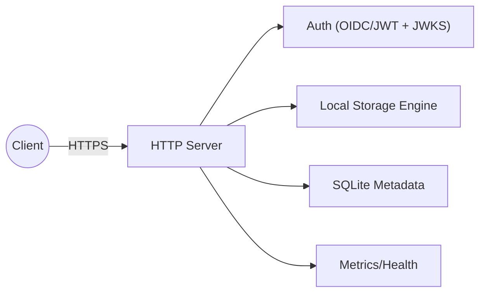

# NebulaFS

NebulaFS is a production-grade, cloud-storage style file server written in C++20 using Boost.Asio/Beast for async HTTP and Poco for configuration, logging, and utilities. It is built as a learning-by-building project that scales from a single-node file server to a distributed storage cluster.

## Highlights

- **Async HTTP** server with Boost.Asio/Beast and multi-threaded IO.
- **Local filesystem storage** with atomic writes and checksum-based ETags.
- **SQLite metadata** for buckets and objects.
- **Structured logging** via Poco with request correlation.
- **Security-first** design with OIDC/JWT auth and JWKS validation support.

## Architecture (Milestone 0–3)



## Quickstart

### Prerequisites
- CMake 3.20+
- C++20 compiler
- vcpkg

### Build
```bash
cmake --preset debug
cmake --build --preset debug
```

### Run
```bash
./build/debug/nebulafs --config config/server.json
```

### Example API calls
```bash
# Health
curl http://localhost:8080/healthz

# Create bucket
curl -X POST http://localhost:8080/v1/buckets -d '{"name":"demo"}'

# Upload object
curl -X PUT \
  --data-binary @README.md \
  http://localhost:8080/v1/buckets/demo/objects/readme.txt

# Upload object (query-style)
curl -X POST \
  --data-binary @README.md \
  "http://localhost:8080/v1/buckets/demo/objects?name=readme.txt"

# Download object
curl http://localhost:8080/v1/buckets/demo/objects/readme.txt -o readme.txt

# List objects
curl "http://localhost:8080/v1/buckets/demo/objects?prefix=read"
```

### Authentication test (Keycloak local)

Use this to validate `auth.enabled=true` end-to-end.

1. Start Keycloak:
```bash
docker run --name keycloak -p 8081:8080 \
  -e KEYCLOAK_ADMIN=admin \
  -e KEYCLOAK_ADMIN_PASSWORD=admin \
  quay.io/keycloak/keycloak:26.0 start-dev
```

2. Set `auth` in `config/server.json`:
```json
"auth": {
  "enabled": true,
  "issuer": "http://127.0.0.1:8081/realms/master",
  "audience": "",
  "jwks_url": "http://127.0.0.1:8081/realms/master/protocol/openid-connect/certs",
  "cache_ttl_seconds": 300,
  "clock_skew_seconds": 60,
  "allowed_alg": "RS256"
}
```

3. Restart NebulaFS.

4. Verify protected route without token (should be `401`):
```bash
curl -i http://127.0.0.1:8080/v1/buckets
```

5. Request token and call protected route:
```bash
TOKEN=$(curl -s -X POST \
  "http://127.0.0.1:8081/realms/master/protocol/openid-connect/token" \
  -d "grant_type=password" \
  -d "client_id=admin-cli" \
  -d "username=admin" \
  -d "password=admin" | jq -r .access_token)

curl -i -H "Authorization: Bearer $TOKEN" http://127.0.0.1:8080/v1/buckets
```

Troubleshooting:
- `issuer mismatch`: `auth.issuer` must exactly equal token `iss`.
- `audience mismatch`: set `auth.audience` to match token `aud`, or use empty string to skip.
- `jwks fetch failed`: verify `auth.jwks_url` and IdP reachability from NebulaFS process.

### Known limitations (Milestone 3 baseline)
- OpenSSL 3 deprecation warnings appear in JWT/JWKS test helper code (`RSA_*` APIs). They are test-only warnings and do not block runtime behavior.
- `/metrics` is currently treated as a protected endpoint when `auth.enabled=true` (only `/healthz` and `/readyz` are public).

## Security Model (Current)
- TLS supported via config; disabled by default for local dev.
- Auth is available via OIDC/JWT when enabled in config. Health is public; all other endpoints require a valid token.
- Path traversal protection enforced in storage.
- Size limits enforced by config.

## Performance Notes (Current)
- Async IO with per-connection strands.
- Streaming request bodies to disk with size limits.
- Download supports HTTP range requests.

## Roadmap
- **Milestone 3**: OIDC/JWT validation with JWKS caching (completed).
- **Milestone 4**: Multipart uploads, background cleanup jobs.
- **Milestone 5**: Metrics (Prometheus), rate limiting, timeouts.
- **Milestone 6**: Distributed mode with metadata service and storage nodes.

## Docs
- Architecture: `docs/architecture.md`
- Threat model: `docs/threat-model.md`
- ADRs: `docs/adr/`
- Code style: `docs/code-style.md`

## License
MIT. See `LICENSE`.
